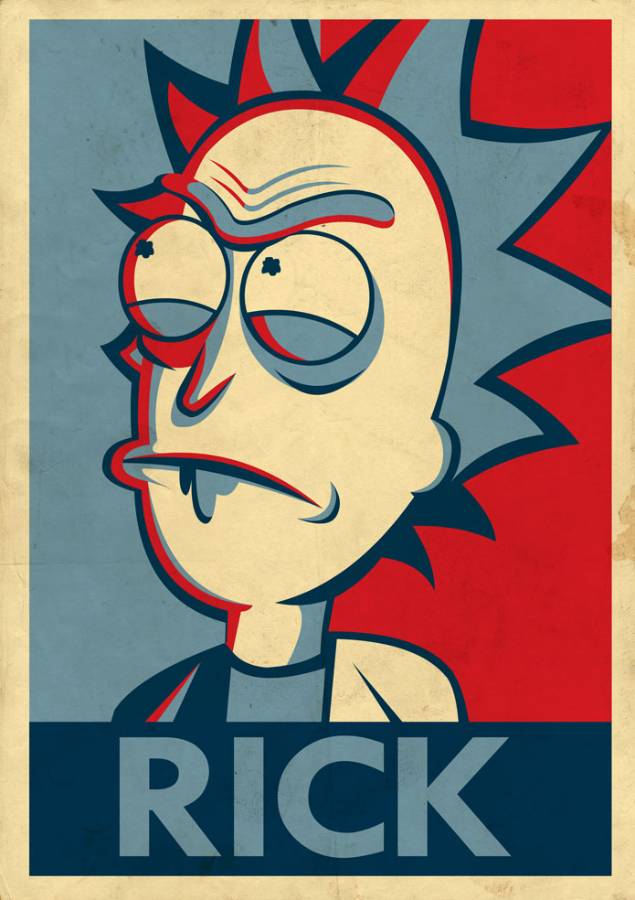
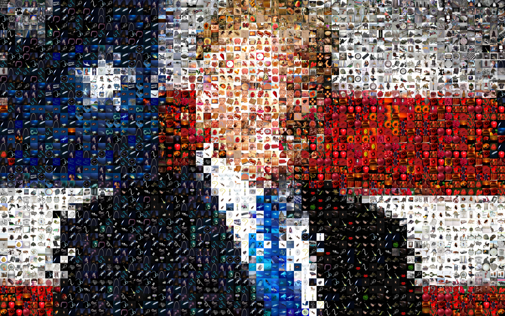

**Convert your image into a patch collage**

# Preliminaries
The script uses the following list of dependencies:

* [Numpy](https://github.com/numpy/numpy)
* [Pillow](https://github.com/python-pillow/Pillow)
* [tqdm](https://github.com/noamraph/tqdm)


We use [CIFAR-100](https://www.cs.toronto.edu/~kriz/cifar.html) dataset as a bank of images. It you want to use other images, please add the additional code to load the images. In order to make it work, prepare the dataset as `np.ndarray` of shape `[n_images, height, width, 3]`.

To prepare **CIFAR-100**, visit the website, download and unzip the dataset. Or you can use our script

```bash
bash load_data.sh
```

# How to use
Just run 

```bash
python patchify.py --source=image.png --output=output.png
```

```bash
optional arguments:
  --source              Image to convert.
  --output              Output file path.
  --dataset             Dataset of images to be used. Defaul is "cifar100"
  --scale               Rescale factor. The size of the image will be `scale`
                        times bigger than the original one. Default is "1".
  --processes           Number of threads to be utilized. By default the
                        maximum number of threads would be utilizaed.
  --num-images          Number of images to use. The images will be chosen
                        randomly from the provided dataset. By default all the
                        images are used.
  --diversity           Number of the most related images from which the best
                        will be chose randomly. Default is 10. If `diversity`
                        is 1 then the most related image will always be
                        chosen. The growth of `diversity` increases the
                        "expressive power" of the resulting collage but
                        degrades the approximation.
```

# Diversity vs scale
<div align="left">	
	
	
	
	
</div>

<div align="left">	
	
	
	
	
</div>

<div align="left">	
	
	
	
	
</div>


# Results

<div align="left">	
	
	
</div>

<div align="left">	
	
	
</div>

<div align="left">	
	
	
</div>


