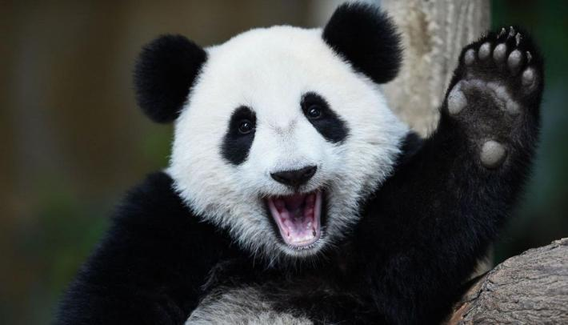

Convert your image into a patch collage

# Preliminaries
The script uses the following list of dependencies:

* [Numpy](https://github.com/numpy/numpy)
* [Pillow](https://github.com/python-pillow/Pillow)
* [tqdm](https://github.com/noamraph/tqdm)


We use [CIFAR-10](https://www.cs.toronto.edu/~kriz/cifar.html) dataset as a bank of patches. It you want to use other images, please some additional code to load the dataset. In order to make it work, load the dataset as `np.ndarray` of shape `[n_images, height, width, 3]`.

In order to prepare **CIFAR-10**, visit the website, download and unzip the dataset. Or you can use our script

```bash
bash load_data.sh
```

# How to use
Just run 

```bash
python patchify.py --source=image.png --output=output.png
```

```bash
optional arguments:
  -h, --help            show this help message and exit
  --dataset             bank of images to be used
  --source              image to convert
  --scale               rescale factor
  --output              output file path
  --processes           number of threads to be utilized
  --num-images          number of images to use
```

# Results

<div align="left">	
	
	
</div>

<div align="left">	
	
	
</div>

<div align="left">	
	
	
</div>

Thanks to [Ivan Sosnovik](https://github.com/ISosnovik) for help.


